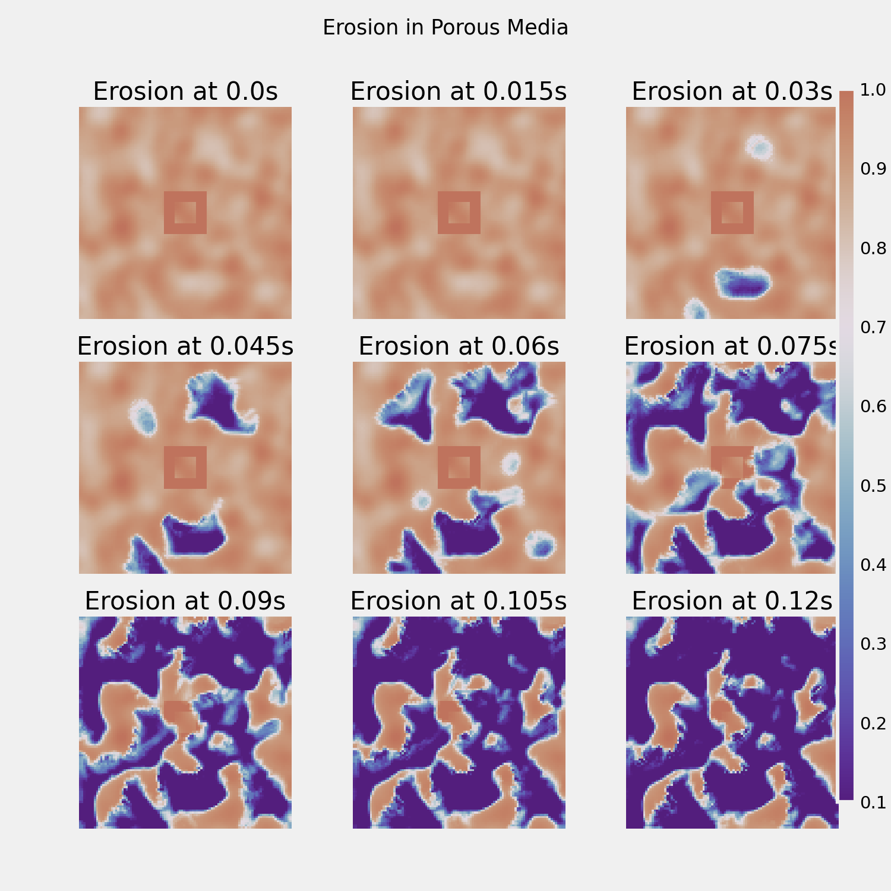

# Building Toy Dams: Modeling Stream Flow Around Obstacles in a Porous Media
This project repository contains codes for the implementation of Julian Schmitt and Chelsea Chen's Final Project for AM205. 

## 1D Model
We initially tried modeling erosion using a 1D model as this was much simpler to implement, however we found that the results were rather boring and so decided to tackle the 2D case. Results for the 1D model experiment can be found in the [1D Model Folder.](1D_model). Below we include an image of how quickly the erosion is progressing as compared to the start value. We found that essentially erosion happened slighly faster in regions which were initialized with lower solid fraction, and otherwise erosion progressed fairly evenly across the entire 1D domain
<!--  -->

## 2D Model 
The 2D model was much more exciting (and time intensive). In this repo we include a script that replicates our findings out of the box from python command line. The only user-specified command line argument is the number of time steps to complete - for our paper we used about 400 time steps or about 0.2 seconds. That file is [`model.py`](2D_model/model.py) with a [`utils.py`](2D_model/utils.py) file also needed for implementation. We have also included a notebook which we used when debugging and is helpful to visualize what some of the code is doing. That one's called [`erode_2D.ipynb`](2D_model/erode_2D.ipynb). Below is an image of the results of our 2D simulation where we've added some defenses to try and defend our ``imaginary" castle at the center of the grid. Sadly, the defenses were not a success :) 

## Acknowledgements
Thank you so much to all the AM205 teaching staff, especially Chris Rycroft, Nick Derr, and Jovana Andrejevic for helping with this project. We’re so grateful for all the time and support you’ve given us throughout the semester.

